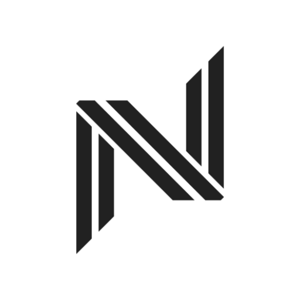

<div align="center">
    
    <h1>Nyx</h1>
    <h4>Do you have a secret to share? Hide it inside an image, locked with a password.</h4>
    <p>
        <a href="LICENSE"></a>
        <a href="https://github.com/daksh7011/Nyx/actions/workflows/ci.yml"></a>
    </p>
</div>

## Overview

Nyx hides an encrypted text message inside the pixels of an ordinary image.
The message is sealed with AES-256-GCM using a key derived from your password,
written into the least significant bits of the image's RGB channels, and
exported as a lossless PNG. To everyone else it is just a picture; with the
password, Nyx recovers the exact message.

Nyx is a Compose Multiplatform app: one Kotlin codebase runs on Android,
desktop (Linux/macOS/Windows), the web (Kotlin/Wasm), and iOS.

## How it works

```text
message ──(AES-256-GCM)──> encrypted blob ──(LSB embed, 2 bits per R/G/B channel)──> stego PNG
          key = PBKDF2-HMAC-SHA256(password, 600,000 iterations, random 16-byte salt)
```

1. **Encrypt** — the plaintext is sealed with AES-256-GCM. Every message gets a
   fresh random salt and nonce, so encrypting the same text twice produces
   different blobs. GCM is authenticated: a wrong password or a tampered image
   fails cleanly — you never get garbage output.
2. **Embed** — the encrypted blob is marker-framed and spread across the two
   least significant bits of each pixel's red, green, and blue channels.
   Payloads too large for one image can span multiple images.
3. **Export** — the result is always PNG (lossless — required for the payload
   to survive). Decrypting reverses the pipeline: extract, authenticate, decrypt.

## Features

- **Encrypt wizard** — pick a cover image (file picker on every platform,
  camera on Android/iOS), type a message and password, get a stego PNG saved
  to your vault and ready to share.
- **Vault** — a grid of your stego images with detail view, share/export,
  archive, and delete. Metadata lives in SQLDelight; image bytes live as PNG
  files on disk.
- **Decrypt** — open a vault image or pick any image, enter the password,
  reveal and copy the hidden message. Wrong password and no-hidden-message are
  reported honestly and distinctly.
- **Themes** — five palettes (Midnight, Espresso, Nardo, Cream, Mist) with a
  system/light/dark mode override, persisted across launches.
- **Settings** — about, open-source licenses, wipe vault, app version.
- **Ad-free, account-free, network-free** — Nyx makes zero network calls.
  Your images and secrets never leave your device.

## Platforms

| Platform | Vault persistence | Camera capture | Notes |
|---|---|---|---|
| Android 7.0+ (API 24) | Yes | Yes | Primary target |
| Desktop JVM (Linux / macOS / Windows) | Yes | No | Compose for Desktop |
| Web (Kotlin/Wasm) | Session-only | No | Encrypt / decrypt / export fully work; the vault list is in-memory for now |
| iOS (device + simulators) | Yes | Yes | Builds on the macOS lane only |

## Architecture

```text
:androidApp        :desktopApp        :webApp        client/iosApp/ (Xcode, macOS only)
      \                 |                /
       +----------------+---------------+
                        |
                     :client            global DI (initKoin), App(), SqlDelight NyxDb,
                        |               platform source implementations
   :feature:{navigation,splash,theme,vault,encrypt,decrypt,settings}:client:{api,basic}
                        |               plumbing: :feature:common:client:{api,koin}
      +---------+-------+------+------------------+----------------------+
      |         |              |                  |                      |
   :crypto   :steganography  :shared:data   :shared:presentation  :shared:design-library
   AES-GCM   pure-Kotlin     results/sources  BaseViewModel,        Nx* components + tokens
   + PBKDF2  LSB engine      events/clock/ids ViewState/UiState      \- :snapshot (Paparazzi)

   test infra: :shared:test-support, :shared:compose-test-support
```

- **Feature modules** (`:feature:X:client:{api,basic}`): `api` exposes a
  `Feature` interface plus type-safe `@Serializable` routes; `basic` implements
  it behind an isolated Koin container. Features never depend on another
  feature's `api` — cross-feature signaling goes through a `DomainEventBus`.
- **Engines**: `:crypto` (cryptography-kotlin, AES-256-GCM + PBKDF2) and
  `:steganography` (stdlib-only LSB codec over `PixelImage`) depend on no other
  project module and are consumed through use cases.
- **`:client`** owns global DI, the SqlDelight database, and the per-platform
  implementations of the source interfaces declared in `:shared:data`.
- **Design system**: `Nx*` atomic components with theme tokens, previews for
  every visual state, and Paparazzi golden tests in
  `:shared:design-library:snapshot`.
- **Convention plugins** in `build-logic/` keep module build scripts
  declarative; `gradle/libs.versions.toml` is the single version source.

## Building

Prerequisites: JDK 21 and an Android SDK with API 36. iOS additionally
requires macOS with Xcode.

```bash
./gradlew build                                    # everything: assemble + tests + detekt
./gradlew :androidApp:assembleDebug                # Android APK
./gradlew :androidApp:installDebug                 # install on a connected device
./gradlew :desktopApp:run                          # run the desktop app
./gradlew :webApp:wasmJsBrowserDevelopmentRun      # dev server for the web app
./gradlew :shared:design-library:snapshot:verifyPaparazziDebug   # design-system goldens
```

**Linux / Windows note:** iOS targets are skipped automatically
(`kotlin.native.ignoreDisabledTargets=true`); everything else builds and tests
locally. iOS compilation and the `client/iosApp/` Xcode project are validated
on the macOS lane.

## Security model (please read)

- **The security layer is the cryptography, not the steganography.** Messages
  are encrypted with AES-256-GCM; keys derive from your password via
  PBKDF2-HMAC-SHA256 with 600,000 iterations and a random 16-byte salt, with a
  fresh random nonce per message. GCM is authenticated encryption — a wrong
  password or a modified image is detected and rejected, never silently
  decrypted into noise.
- **LSB steganography is an obscurity layer.** Statistical steganalysis can
  reveal that an image likely carries a payload. Assume a capable adversary can
  detect that something is hidden; what they cannot do without your password is
  read it.
- **PNG only survives lossless channels.** Messaging apps and social networks
  that recompress images (usually to JPEG) destroy the payload. Share the stego
  image as a file, not as an inline photo.
- **Your password is the whole game.** A weak password falls to offline
  guessing regardless of iteration count. There is no recovery mechanism: lose
  the password, lose the message.
- **Clean break from pre-rewrite Nyx.** Images produced by the old (pre-2026)
  Android app use an abandoned format and cannot be decrypted by this version.

Nyx is an experimental open-source project provided under the MIT license,
without warranty of any kind. It builds on well-reviewed primitives via
[cryptography-kotlin](https://github.com/whyoleg/cryptography-kotlin), but it
has not been independently audited. Do not rely on it as your only protection
for high-stakes secrets.

## Contributing

See [CONTRIBUTING.md](CONTRIBUTING.md) for dev setup, architecture
conventions, and the add-a-feature checklist. Contribution is not limited to
code — feature ideas, docs, UI design ideas, and even typo fixes are welcome.
You are just an issue away: [issue tracker](https://github.com/daksh7011/Nyx/issues).

This project follows a [code of conduct](CODE_OF_CONDUCT.md).

## Emailware

Nyx is an emailware. Which means, if you liked using this app or it has helped
you in any way, I'd like you to send me an email at
[daksh@technowolf.in](mailto:daksh@technowolf.in) about anything you'd want to
say about this software. I'd really appreciate it! Plus I would be more than
happy to know my initiative helped someone. :)

## License

[MIT License](LICENSE) — Copyright (c) 2020 TechnoWolf FOSS
